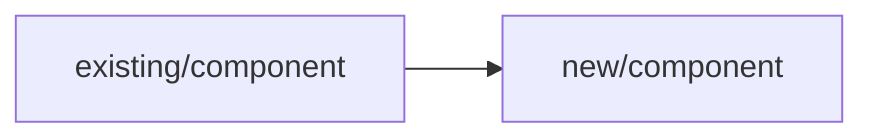
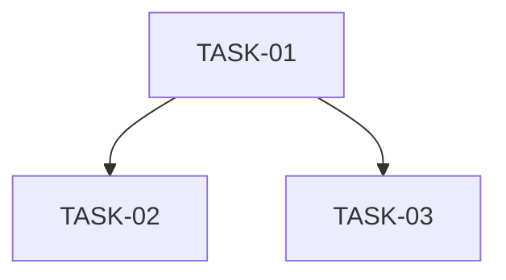

<!--
Authoring guidance (delete this comment block in the produced document):

This is the human-first design-document format. The design document is a human
review surface — an engineer reads it and signs it off before task generation —
so it must lead with the skim path and push machine-dense detail one click away,
while staying fully readable as raw Markdown to every downstream agent.

- The document renders natively on GitHub and in IDE Markdown preview. Use only
  the `<details>`/`<summary>` and `mermaid` constructs introduced below — do not
  introduce any other raw HTML tag.
- `## Summary` comes first, immediately after the six-line header (never between
  header lines). It is a skim aid, distinct from the seven body sections below.
- `mermaid` fenced diagrams and `<details>`/`<summary>` zones are browser-only
  affordances: an agent reads the full raw Markdown, so collapsing detail never
  removes it from the document. Keep every machine fact in the prose/structured
  sections regardless of what a diagram shows.
- ILLUSTRATIVE-ONLY: the `## Summary`, the `mermaid` diagrams, and the GitHub
  callouts must never be the sole source of any machine fact (an interface
  contract, a constraint, an acceptance criterion, a task dependency). Those
  facts live in the seven prose/structured sections, which Phase 2 transcribes
  into task specs. A diagram may visualise the dependency order and a callout may
  flag the risk, but neither is ever its only source.
- Describe behaviour and intent only — never name a specific programming language
  as a required construct or example (this template fans out to many languages).
-->

# Design: [Feature name]
JIRA: [ticket]
Engineer: [name]
Requirements: [link to Artefact 1 — JIRA ticket, docs/requirements/ path, or "N/A"]
Date: [ISO 8601 date]
Branch: [branch name]
Feature-Id: [feature identifier recovered from the requirements artefact, e.g. quartz-amber-ronin-7e67]

## Summary

The skim path for a human reviewer. Place this section first, immediately after
the six-line header. It is distinct from the seven body sections below — do not
fold it into them — and it is illustrative-only: every fact it states must also
appear in the body section that owns it.

Write the four sub-points below, in order:

**What changed & why.** One short paragraph: what this change does and the reason
for it, in plain language a reviewer can read in seconds.

**Decisions needing judgement.** The calls a reviewer should weigh — the choices
that were not forced and could reasonably have gone another way. The binding
statement of each lives in _Approach_ / _Task breakdown_; this is the skim aid.

**Assumptions.** What this design takes as given. Flag anything a reviewer should
confirm.

**Where the risk is.** What could go wrong and which body section holds the
mitigation. The binding source is _Risks and constraints_; this is the pointer.

Flag the Summary's judgement-calls and risk with GitHub callouts — used
**sparingly**, in the `## Summary` only, never on every section:

```
> [!IMPORTANT]
> The decisions needing judgement — a one-line skim of the calls a reviewer
> should weigh.

> [!WARNING]
> Where the risk is — a one-line skim of the main risk. Use [!CAUTION] instead
> for a guardrail protecting a machine consumer.
```

Callout rules:
- Use only the supported types: NOTE, TIP, IMPORTANT, WARNING, CAUTION. The type
  marker is the first line of the blockquote on its own line; content follows on
  later `>` lines.
- They are blockquote syntax, not raw HTML — they sit alongside `<details>` /
  `<summary>` / `mermaid` without introducing any other HTML tag.
- They are illustrative-only: a callout must never be the sole source of a
  machine fact.
- They degrade cleanly: native on GitHub and in recent VS Code preview, falling
  back to a plain readable blockquote anywhere unsupported. Do not assume every
  IDE renders them.

<!-- CONDITIONAL SECTION: "Inputs / prior-planning references".
     Include this section ONLY when an upstream approach brief was used (the
     engineer answered "yes" to the opt-in question and the brief was accepted).
     When no brief was used, OMIT this section entirely so the cold-path output
     is byte-for-byte identical to a design authored without a brief.
     The section is front-loaded: it sits ABOVE "## Approach".
     Each entry is a clickable relative Markdown link plus one line of what it
     provided. It references the source; it never condenses or paraphrases it.
     See .claude/skills/shared/approach-brief-intake.md for the full contract.

## Inputs / prior-planning references

- [Source title](relative/path#anchor): one line of what this source provided.
- [Source title](relative/path#anchor): one line of what this source provided.
-->

## Approach

High-level description of the implementation strategy. One to three paragraphs.

Explain why this approach was chosen over evident alternatives. What problem
does it solve and how? What is the high-level shape of the change?

This section should give a reader who knows the codebase enough context to
understand every subsequent section without needing to look things up.

## Components affected

Lead with a `mermaid` component map showing the affected services, modules, and
files and how the change flows between them. The diagram is illustrative — it
visualises the list below, it does not replace it:



**Existing (modified):**
- `path/to/component` — brief description of what changes and why

**New (created):**
- `path/to/new/component` — purpose and responsibility

List all services, modules, classes, and files that will be touched or created.
Be specific enough that the task breakdown can reference them by name.

## Interface contracts

For each new or modified interface, write the contract below. When there are
several contracts, or any single contract is long, collapse the detail inside a
`<details>` block so the skim path stays short. Keep the `## Interface contracts`
heading itself outside the `<details>` block (heading visible, content
collapsible):

<details>
<summary>Contracts</summary>

### [InterfaceName]

Input: [types, valid ranges, null handling, required vs optional]
Output: [types, constraints, what "success" looks like]
Errors: [explicit error types and the conditions that trigger them]
Side effects: [state changes, events emitted, external calls made — "none" if none]

</details>

Repeat the contract block for every interface. If no interfaces are new or
modified, write "No new or modified interfaces."

## Task breakdown

Lead with a `mermaid` dependency graph showing the tasks and the dependencies
between them. The diagram is illustrative — the binding dependency facts are the
list below it:



Ordered list of tasks with dependencies. Each task must be independently
implementable by an AI agent from a single task spec. When per-task detail is
long, collapse it inside a `<details>` block, leaving the `## Task breakdown`
heading outside the block:

TASK-01: [name] — no dependencies
TASK-02: [name] — depends on TASK-01 (needs [specific output or artefact])
TASK-03: [name] — depends on TASK-01, parallel with TASK-02

Rules:
- Each task is a thin end-to-end vertical slice sized to one Opus-level agent's
  loadable working set — the task spec plus the files it must read and write,
  with headroom to reason. A slice may span multiple components when they serve
  one outcome. Fold trivial edits and their tests into the slice whose agent
  already holds the context; split a task out only when bundling it would risk
  context pressure. No token-count threshold — sizing is qualitative.
- Each task name is specific enough to derive a unique slug.
- Dependencies name the specific output or artefact needed, not just the task.
- At least one task is required.

## Test strategy

Integration test owner: [which task or tasks own integration tests]
E2E approach: [scope, tooling, environments — "N/A" if no E2E tests]
Cross-task constraints: [shared fixtures, test data, ordering — "none" if none]

Describe how the tasks fit together in the test picture. Which task is
responsible for ensuring the whole feature works end-to-end? Are there
ordering constraints between test suites?

## Risks and constraints

What could go wrong. What Claude must not do. Anything that needs extra
attention during implementation or validation.

- [Risk or constraint]: [why it matters and what the mitigation or rule is]
- [Risk or constraint]: [why it matters and what the mitigation or rule is]

Include external interface risks, behavioural constraints inherited from
product requirements, and any "must not touch" boundaries.

## ADR references

Existing decisions that constrain this design:
- [docs/decisions/NNN-name.md] — [one sentence on how it constrains this design]

New decisions being made (create ADR if significant):
- [proposed ADR title] — [one sentence on the decision being recorded]

If no ADR references apply, write "No ADR references."
